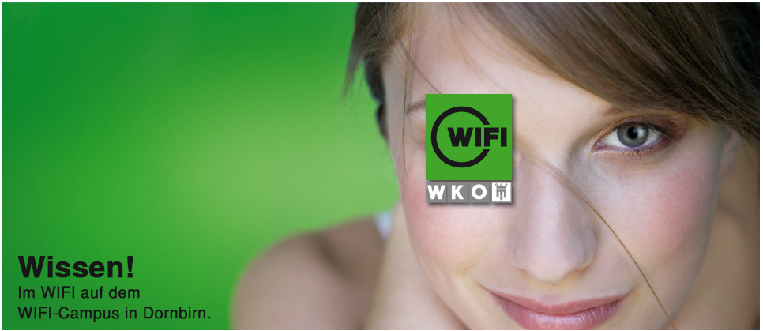
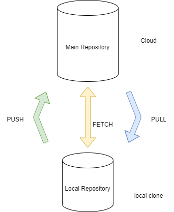

# FIT Omicron - C# basics

Starting with C# and much more!

Topics included into this class:
- C# basics
- GIT basics
- UML basics

 To learn more about Markdown Syntax please click [HERE](https://www.markdownguide.org/basic-syntax/)! 

This *is* a very **important** part.

## GIT basics

